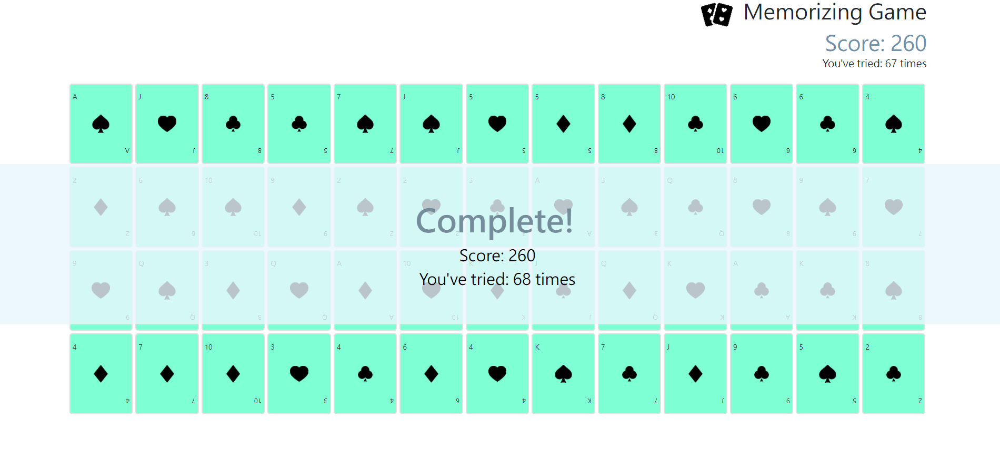

#  Memorizing Card Game :black_joker:

## GAME RULE
- Flap two cards in 1 round. Pair cards with same numbers and get 10 points of score for each pair.  
- If pair matched, the cards keep number side on. If pair not matched, the cards flap back after 1 second.  
- Game finished when score reaches 260 points. 

